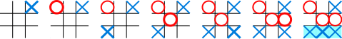

# Tic Tac Toe

Tic-tac-toe (also known as noughts and crosses or Xs and Os) is a game for two players, X and O, who take turns marking the spaces in a 3x3 grid. The player who succeeds in placing three of their marks in a horizontal, vertical, or diagonal row wins the game.

>*The following example game is won by the first player, **X***:
<div style="text-align: center;">

</div>

***

## Installation:

 Install Dependencies
```bash
npm install
``` 
Start Server
```bash
npm start
```

Go to http://localhost:3000 to play Tic Tac Toe.

***

## How to Play

* Simply click a square to select it. 
* Click "Auto Move" to automate the next move.
* No square may be selected twice.
* Three in a row wins.
* When there is a winner or a tie, the game is over.
* Click "Reset" to play again.

### Strategy

A player can play a perfect game of tic-tac-toe (to win or, at least, draw) if they choose the first available move from the following list

* **Win**: If the player has two in a row, they can place a third to get three in a row.

* **Block**: If the opponent has two in a row, the player must play the third themselves to block the opponent.
* **Fork**: Create an opportunity where the player has two threats to win (two non-blocked lines of 2).

* **Blocking an opponent's fork**:
    * **Option 1**: The player should create two in a row to force the opponent into defending, as long as it doesn't result in them creating a fork. For example, if "X" has a corner, "O" has the center, and "X" has the opposite corner as well, "O" must not play a corner in order to win. (Playing a corner in this scenario creates a fork for "X" to win.)
    * **Option 2**: If there is a configuration where the opponent can fork, the player should block that fork.
* **Center**: A player marks the center. (If it is the first move of the game, playing on a corner gives "O" more opportunities to make a mistake and may therefore be the better choice; however, it makes no difference between perfect players.)

* **Opposite corner**: If the opponent is in the corner, the player plays the opposite corner.

* **Empty corner**: The player plays in a corner square.

* **Empty side**: The player plays in a middle square on any of the 4 sides.

## License

  [TLM](LICENSE)